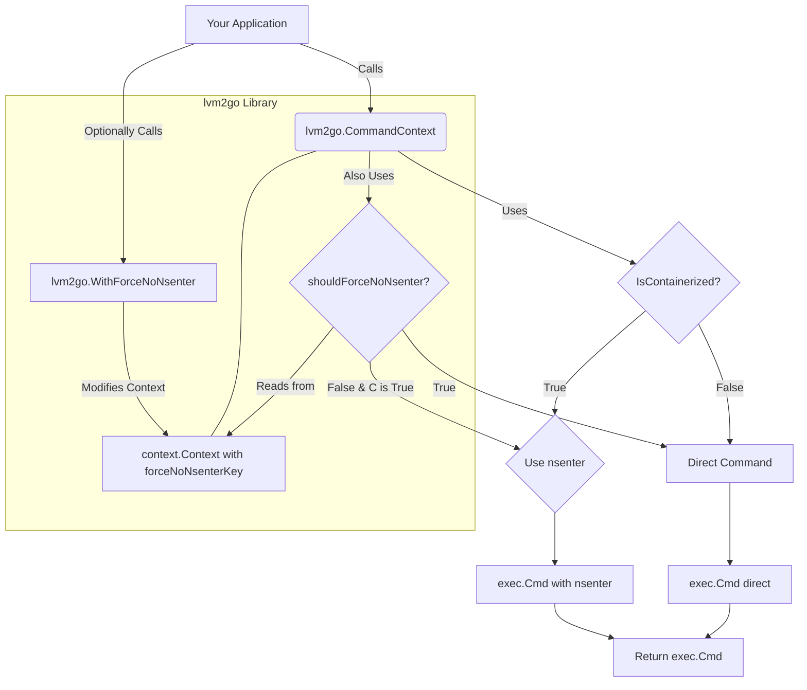

# Plan to Add a "ForceNoNsenter" Option via Context

This document outlines the plan to add an option to the `lvm2go` library to bypass the `nsenter` execution path when running commands in a containerized environment, even if `IsContainerized(ctx)` returns true. This will be achieved by introducing a new context value.

## 1. Define a new private context key

A new unexported context key will be defined to prevent collisions.

```go
// In command.go
var forceNoNsenterKey = struct{}{}
```

## 2. Create a public "With" function

This function will allow users of the library to create a new context with the "force no nsenter" flag set.

```go
// In command.go
func WithForceNoNsenter(ctx context.Context, force bool) context.Context {
	return context.WithValue(ctx, forceNoNsenterKey, force)
}
```

## 3. Create a private "getter" function

This function will be used internally by `CommandContext` to check the value of the flag.

```go
// In command.go
func shouldForceNoNsenter(ctx context.Context) bool {
	if force, ok := ctx.Value(forceNoNsenterKey).(bool); ok {
		return force
	}
	return false // Default to false (i.e., use nsenter if containerized and flag not set)
}
```

## 4. Modify the `CommandContext` function

The core logic in `CommandContext` will be updated to check this new context value.

**Current relevant section:**

```go
// In command.go
if IsContainerized(ctx) {
    args = append([]string{"-m", "-u", "-i", "-n", "-p", "-t", "1", cmd}, args...)
    c = exec.CommandContext(ctx, nsenter, args...)
} else {
    c = exec.CommandContext(ctx, cmd, args...)
}
```

**Proposed modification:**

```go
// In command.go
if IsContainerized(ctx) && !shouldForceNoNsenter(ctx) { // Modified condition
    args = append([]string{"-m", "-u", "-i", "-n", "-p", "-t", "1", cmd}, args...)
    c = exec.CommandContext(ctx, nsenter, args...)
} else {
    c = exec.CommandContext(ctx, cmd, args...)
}
```

## Mermaid Diagram of the Proposed Change



## How this would be used in your application

```go
package main

import (
	"context"
	"fmt"
	"log"
	"os/exec"

	"your_module_path/lvm2go" // Assuming lvm2go is in your module
)

func main() {
	ctx := context.Background()

	// Example 1: Standard behavior (uses nsenter if containerized)
	cmd1 := lvm2go.CommandContext(ctx, "ls", "-l", "/")
	fmt.Println("Cmd1 Path:", cmd1.Path)
	fmt.Println("Cmd1 Args:", cmd1.Args)

	// Example 2: Force no nsenter, even if containerized
	ctxNoNsenter := lvm2go.WithForceNoNsenter(ctx, true)
	cmd2 := lvm2go.CommandContext(ctxNoNsenter, "ls", "-l", "/")
	fmt.Println("Cmd2 Path:", cmd2.Path) // Will be "ls", not nsenter
	fmt.Println("Cmd2 Args:", cmd2.Args)

    // Example of running a command (error handling omitted for brevity)
    output, err := cmd2.CombinedOutput()
    if err != nil {
        log.Fatalf("Command failed: %v, Output: %s", err, string(output))
    }
    fmt.Printf("Output of cmd2:\n%s\n", string(output))
}

```

This approach:

* Is non-intrusive to existing users of the library.
* Provides clear, explicit control for when to bypass `nsenter`.
* Follows established Go patterns for passing optional parameters.
